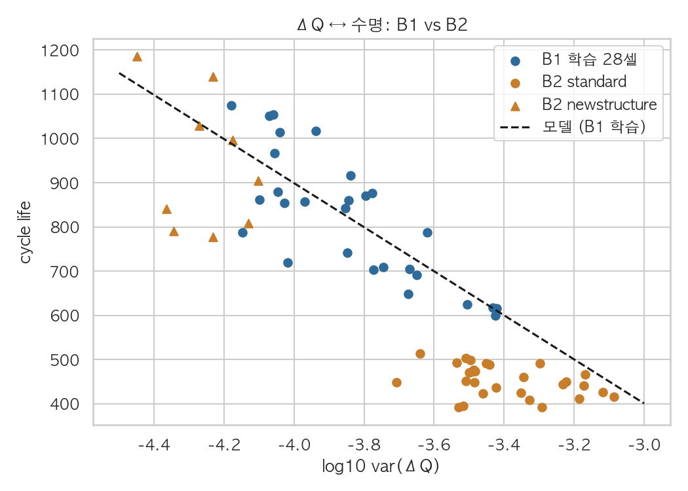

# ESS 배터리 수명 예측
초기 100사이클의 충방전 기록만으로 배터리 셀의 총 수명(Cycle Life)을 예측해, ESS 배터리 교체·점검 시점을 미리 계획할 수 있는지 검증한다.


## 프로젝트 개요
- 데이터셋 : MIT-Stanford Battery Dataset (Severson et al., Nature Energy 2019)
- 학습 데이터 : Batch 1 (2017-05-12) — 종료 근접 36셀 → 학습 28셀 / 홀드아웃 8셀 (정책 단위 분할)
- 평가 데이터 : Batch 2 (2018-02-20) 39셀 · 추가 평가 Batch 3 (2018-04-12) 44셀
- 태스크 : **Regression** — `cycle_life` (QD < 0.88 Ah 도달까지의 총 사이클 수) 예측, 지표 MAPE


## 파일 구조
```
├── data/
│   └── README.md                     # 데이터 다운로드 · 캐시 생성
├── notebooks/
│   ├── 01_EDA.ipynb                  # Q1~Q5 핵심 결과
│   ├── 02_feature_engineering.ipynb  # 피처 근거 · 레이블 점검 · 입력 범위
│   └── 03_modeling.ipynb             # CV 비교 · 평가 · 오류 분석 (그림 생성)
├── src/
│   ├── preprocess.py                 # .mat → 셀 단위 캐시
│   ├── features.py                   # log10 var(ΔQ) · 충전 정책 피처
│   └── train.py                      # 분할 · CV · 학습 · 평가 → results/
├── results/
│   ├── model_performance.csv         # 성능 리포트 (Format)
│   ├── cv_comparison.csv             # 후보 모델 × 입력 구성 CV 비교
│   ├── cv_diagnostics.csv            # Elastic Net 폴드별 계수 · 잔차 곡률
│   ├── test_breakdown.csv            # 실험집단 · 입력 범위 · 정책별 성능
│   ├── predictions.csv               # 셀별 예측값
│   ├── pred_vs_actual.png
│   └── dq_shift_b1_b2.png
├── requirements.txt
└── README.md
```


## 환경 설정
```bash
git clone https://github.com/minsol1/ess-battery-project.git
cd ess-battery-project
pip install -r requirements.txt

python -m src.preprocess   # data/README.md 의 .mat 파일 → 캐시
python -m src.train        # 학습 · 평가 → results/*.csv
```


## EDA

- Cycle Life 분포
	- 중앙값 B1 858.5 / B2 472 / B3 1005.5 · 단수명(<500) 비율 B1 0% / B2 71.8% / B3 0%
	- 핵심 발견 : B1에 없는 단수명 구간이 B2에 몰려 있어, B2 평가는 학습 분포 밖 예측이 된다.

- 열화 곡선 분석
	- 10→100사이클 용량 변화는 장·단수명 모두 ±0.02 mAh/사이클 이내로 차이가 없다. 수명 마지막 20% 구간에서는 단수명 셀이 1.5~1.8배 빠르게 감소한다.
	- Knee point는 예측 시점 이후에 나타난다 (중앙값 B1 579 / B2 361 / B3 827사이클, Day 1 기준).
	- 핵심 발견 : 초기 용량 감소량만으로는 수명을 구분할 수 없다.

- ΔQ(V) 곡선 분석
	- ΔQ(V) = Q100(V) − Q10(V). 세 배치 모두 단수명 셀의 전압별 변화가 더 크다.
	- 핵심 발견 : `log10 var(ΔQ)`가 세 배치 모두에서 수명과 가장 강하게 연결된다 (Spearman −0.87 / −0.71 / −0.80).

- 충전 속도(C-rate)와 수명의 관계
	- 최대 전류가 큰 정책일수록 수명이 짧다 (B1 평균 C ρ=−0.43, B3 최대 C ρ=−0.61).
	- 핵심 발견 : 같은 4.8C(80%)-4.8C 정책에서도 배치·실험집단에 따라 평균 수명이 484~1,564로 다르다. 정책만으로는 배치 차이를 설명할 수 없다.

- 추가 확인
	- 정책 평균을 빼면 ΔQ–수명 상관이 −0.82 → −0.11로 약해진다. ΔQ 신호의 상당 부분이 정책 차이를 반영한다.
	- B1의 10셀은 EOL 전에 기록이 끝나(마지막 QD > 0.885 Ah) 레이블에서 제외했다.


## Modeling

### 피처 엔지니어링 전략
- `log10 var(ΔQ)` : ΔQ 평균·최솟값과 |ρ| ≥ 0.97로 중복되어 분산 하나만 쓴다. 로그 변환으로 왜도를 +1.11 → +0.22로 줄였다.
- 충전 정책 : 원정책(`C1`, `C2`, `SOC1`)과 파생정책(`mean_C`, `max_C`) 두 가지 표현으로 비교했다.
- 입력 5구성(ΔQ / 원정책 / 파생정책 / ΔQ+원정책 / ΔQ+파생정책) × 타깃 2종(원 수명 / log 수명)을 정책 그룹 4-fold CV로 비교했다.

### 모델 선택 및 근거
- 후보 모델 : 기준선(1/y 가중 중앙값), Ridge, Elastic Net, 얕은 회귀트리(깊이 2, 리프 최소 5셀)
- 최종 모델 : **Ridge · 입력 `log10 var(ΔQ)` · 원 수명 타깃** (CV MAPE 8.95%)
- 선택 이유 :
	- 학습 셀이 28개로 적고 정책 변수끼리 겹친다(C1↔SOC1 ρ=−0.88). 그래서 정규화 선형 모델을 기준으로 삼았다.
	- 정책 변수를 더하면 CV MAPE가 1%p 이상 나빠졌다 (ΔQ 8.95% → ΔQ+정책 10.0~10.4%).
	- Elastic Net(9.62%)과 트리(10.77%)는 채택 기준(MAPE 1%p 이상 감소 + 4개 중 3개 폴드 개선)을 넘지 못했다. 다변수 입력에서도 Elastic Net은 ΔQ만 모든 폴드에서 선택했다.

| 모델 | 입력 | CV MAPE (%) |
|---|---|---|
| 기준선 | - | 16.43 |
| **Ridge** | **ΔQ** | **8.95 ± 2.21** |
| Ridge | 원정책 / 파생정책 | 13.90 / 13.40 |
| Ridge | ΔQ+원정책 / ΔQ+파생정책 | 10.02 / 10.31 |
| Elastic Net | ΔQ / ΔQ+원정책 | 9.62 / 10.64 |
| 얕은 회귀트리 | ΔQ / ΔQ+원정책 | 10.77 / 12.43 |


## 성능 결과

| 구분 | MAPE (%) | 비고 |
|---|---|---|
| Train (Batch 1 CV) | 8.95 | 정책 그룹 4-fold CV 평균 |
| Valid (Batch 1 Hold-out) | 8.02 | 새 정책 8셀 |
| Test (Batch 2) | 28.59 | 39셀 |
| Gap (Train-Valid) | −0.93 | (+) : 과적합 의심 → 과적합 신호 없음 |
| Gap (Valid-Test) | +20.57 | (+) : 배치간 일반화 저하 의심 → 저하 확인 |
| Gap (Target-Test) | +19.49 | Target : 원논문 9.1% |
| Test (Batch 3) | 12.09 | 44셀 |
| Gap (Batch2-Batch3) | −16.51 | Test 성능 간 비교 (B3 − B2) |
| Gap (Target-Test) | +2.99 | Batch 3 기준, 원논문 성능 비교 |

- B1 안에서는 처음 보는 정책에서도 원논문 수준(8~9%)을 유지했다.
- B2 오차는 대부분 standard 30셀에서 나온다 (MAPE 32.6%, 30셀 모두 과대 예측). newstructure 9셀의 MAPE는 15.2%다.
- 원논문은 B1·B2 셀을 섞어 학습·평가했다. 이 과제는 B1만으로 학습했으므로 Gap(Target-Test)는 같은 조건의 비교가 아니다.


## 오류 분석
- 모델이 가장 크게 틀린 셀의 공통점
	- 오차 상위 10셀 중 9셀이 B2 standard이고, 모두 수명을 길게 예측했다 (예: B2_c06 실제 393 → 예측 665).
	- 이 중 8셀은 ΔQ가 학습 범위 안에 있다. 입력 범위 안 셀의 MAPE(36.9%)가 범위 밖 셀(18.9%)보다 크다. 단순한 외삽 문제가 아니다.
- 원인 가설
	- ΔQ와 수명의 관계가 배치마다 다르다. 같은 6C(60%)-3C 정책에서 B1은 744사이클, B2 standard는 400사이클이었다. B2 셀의 ΔQ가 더 크게 나와 방향은 맞지만, B1에서 배운 기울기로는 이 차이를 다 설명하지 못한다.
	- 후보 요인은 셀 로트, 실험 환경, B2 초기 구간의 약 65시간 기록 공백이다.
	- B3의 최대 오차(B3_c38 실제 1,935 → 예측 1,069)는 학습 최대 수명(1,074)을 넘는 셀의 과소 예측이다.
- 개선 방향
	- 여러 배치를 함께 학습하거나, 새 배치의 소수 셀 레이블로 절편을 보정한다.
	- 기록 공백에 덜 민감한 ΔQ 기준 사이클을 비교한다.
	- 과대 예측을 줄이도록 예측 구간 하한이나 분위수 회귀를 함께 제공한다.




## ESS 도메인 해석
- 활용 가능한 의사결정
	- 학습과 같은 배치·조건이라면 전체 수명의 약 9~17%인 초기 100사이클로 수명을 MAPE 8~9%에 추정할 수 있다. 단수명 예상 셀을 미리 골라 팩 구성과 교체 계획에 반영할 수 있다.
	- 충전 정책을 바꾼 뒤 100사이클 만에 열화 영향을 확인하는 조기 지표로 쓸 수 있다.
- 한계
	- 배치가 바뀌면 수명을 길게 예측하는 경향이 있다(B2 standard 과대 예측 100%). 실제 BESS에서는 교체 지연과 예기치 못한 설비 중단으로 이어질 수 있다.
	- 학습 수명 범위가 599~1,074사이클로 좁아, 범위 밖 셀의 예측은 범위 쪽으로 끌려간다.
	- 실험실의 고정 충전·온도 조건과 달리, 실제 ESS 운영 중에는 Q10·Q100 같은 표준 측정 사이클을 얻기 어렵다.
- 실 배포에 추가로 필요한 것
	- 여러 생산 로트의 학습 데이터와 새 로트 보정 절차
	- 주기적인 진단 사이클로 ΔQ(V)를 측정하는 프로토콜
	- 입력이 학습 범위를 벗어날 때의 경고와 예측 구간


## 참고문헌
- Severson et al. (2019). Data-driven prediction of battery cycle life before capacity degradation. *Nature Energy*, 4, 383–391.


## 팀 구성
- 안동선 :
- 김민솔 :
