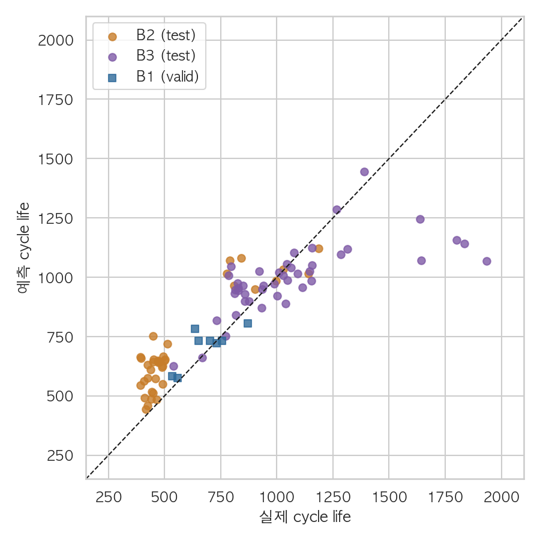

# ESS 배터리 수명 예측

초기 100사이클의 충방전 기록으로 셀의 총 수명(Cycle Life)을 예측하고, ESS 점검·교체 계획에 활용할 수 있는지 검증한다.

**초기 기록에는 수명을 예측할 신호가 있었지만, 새로운 배치에서는 오차의 크기와 방향이 달라졌다. 좋은 검증 점수만으로 ESS 교체 시점을 맡기기 어렵다는 것이 이번 분석의 핵심이다.**

[EDA 그림·근거](docs/eda.md) · [모델·논문 비교](docs/analysis.md) · [검증 기록](docs/validation.md) · [결과 파일](results/README.md) · [Day 1 계획서](docs/day1-plan.pdf)

## 프로젝트 개요

- **데이터**: MIT–Stanford Battery Dataset · Severson et al., *Nature Energy* (2019)
- **학습**: B1(2017-05-12) 종료 근접 36셀 → 학습 28셀 / 정책 단위 홀드아웃 8셀
- **평가**: B2(2018-02-20) 39셀 · 선택 평가 B3(2018-04-12) 44셀
- **태스크**: 회귀 · 총 사이클 수 예측 · 원 단위 MAPE(%)

점검 우선순위를 비교할 수 있도록 예상 수명을 연속값으로 예측했다. B1에 단수명 셀이 거의 없어 장·단수명 분류의 경계를 학습하기 어렵다는 점도 회귀를 선택한 이유다.

## EDA → 모델 전략

| 확인한 내용 | 구현에 반영한 판단 |
|---|---|
| B1에 없는 짧은 수명 구간이 B2에 몰려 있었음 | 단수명 구간과 실험집단별 오류를 구분해 평가 |
| 초기 용량 변화가 작고 급격한 열화는 뒤늦게 나타남 | 100사이클 이후의 경로·변곡점(knee)을 예측 입력에서 제외 |
| 초기 방전 곡선의 변화가 세 배치 모두에서 수명과 연결됨 | `log10 var(Q100(V) − Q10(V))`를 핵심 후보로 사용 |
| 충전 정책·전류 패턴의 관계가 배치마다 다름 | 정책 단독·ΔQ 단독·결합 입력을 같은 CV로 비교 |
| ΔQ 통계가 중복되고 정책 변수도 강하게 연결됨 | 피처 수를 줄이고 Ridge·Elastic Net의 이득을 검증 |

ΔQ는 10번째와 100번째 사이클의 전압별 방전 용량 차이다. 초기의 작은 변화를 한 값으로 요약해 모델에 전달했다. 질문별 그림·수치는 [EDA 상세 페이지](docs/eda.md), 구현은 [EDA 노트북](notebooks/01_EDA.ipynb)과 [피처 설계 노트북](notebooks/02_feature_engineering.ipynb)에서 확인할 수 있다.

## 모델 선택

최종 모델은 **Ridge · ΔQ 단일 입력 · 원 수명 타깃**이다. 학습 28셀의 정책 그룹 4-fold CV MAPE는 **8.84 ± 2.33%** (평균 ± 폴드 표준편차)로, 상수 기준선(16.43%)보다 낮았다. 폴드 표준편차는 신뢰구간이 아니다.

학습 셀이 적어 단순한 모델부터 출발했다. 입력 5구성 × 원·로그 수명을 비교하고 Elastic Net과 얕은 트리도 확인했지만, 입력이나 모델을 복잡하게 만들었을 때 일관된 이득은 없었다. 두 후보 모두 사전 채택 기준인 **최선 Ridge 대비 MAPE 1%p 이상 감소 + 4개 중 3개 폴드 개선**을 충족하지 못해 ΔQ 하나를 쓰는 구성을 선택했다.

하이퍼파라미터는 내부 정책 그룹 3-fold CV로 선택하며, 결측값 대치·표준화는 각 학습 폴드에서만 계산한다. 같은 충전 정책의 셀이 학습과 검증에 섞이지 않도록 분리했다.

[전체 후보 비교](results/cv_comparison.csv) · [모델링 노트북](notebooks/03_modeling.ipynb)

## 성능 결과

| 구분 | MAPE (%) | 해석 |
|---|---:|---|
| Train (Batch 1 CV) | 8.84 | 정책 그룹 4-fold CV · 후보 선택 점수 |
| Valid (Batch 1 Hold-out) | 7.79 | 새 정책 8셀 · 단일 분할 |
| Test (Batch 2) | 27.87 | B2 39셀 |
| Gap (Train-Valid) | -1.05 | 이번 분할에서 홀드아웃 오차 증가 없음 |
| Gap (Valid-Test) | +20.09 | B2에서 오차 증가 |
| Gap (Target-Test) | +18.77 | 과제 기준 9.1%와의 차이 |
| Test (Batch 3) | 12.11 | B3 44셀 · 추가 평가 |
| Gap (Batch2-Batch3) | -15.77 | B3 − B2 |
| Gap (Target-Test, Batch 3) | +3.01 | B3와 과제 기준의 차이 |

Gap의 단위는 **%p**, 계산 방향은 뒤 − 앞이다. CV는 모델 선택에도 사용했고 홀드아웃은 8셀뿐이므로, 음의 Gap으로 과적합을 배제할 수는 없다. 9.1%는 과제 지정 기준이며 논문과 학습·분할·피처·제외 기준이 다르다. [논문 비교 조건](docs/analysis.md#논문-성능과의-비교)

B1에서 잘 맞았던 모델이 B2에서는 크게 틀렸다. 새 생산 배치에서도 잘 맞는지는 별도로 확인해야 한다는 점을 배웠다. 논문과 비교할 때도 점수와 함께 그 점수가 나온 데이터와 평가 조건을 확인해야 했다.



## 오류 분석

- **B2 standard 30셀 모두 수명을 길게 예측했다.** 일부 셀의 우연한 오차로 넘기기 어려운, 한 방향으로 치우친 결과였다.
- **학습 때 본 입력 범위 안에서도 크게 틀렸다.** 값이 익숙한 범위에 있다는 이유만으로 예측을 믿을 수는 없었다.
- **B3 장수명 과소 예측**: B3_c38은 실제 1,935사이클을 1,074사이클로 예측했다. 학습 수명 범위는 599–1,074사이클이었다.

같은 충전 방식에서도 배치별 수명이 달라, 충전 속도만으로 차이를 설명하기 어려웠다. 생산 로트·실험 환경·초기 기록 공백을 원인 후보로 봤지만, 어느 요인이 실제 원인인지는 이번 데이터로 확인하지 못했다. [셀별 오류·집단별 수치·개선 방향](docs/analysis.md#오류-분석)

## ESS 도메인 해석

이번 분석을 통해 현재 용량이 비슷한 배터리도 앞으로 사용할 수 있는 기간은 다를 수 있다는 점을 배웠다. 초기 용량 곡선에서 구분하기 어려웠던 차이를 ΔQ에서 찾을 수 있었지만, 그 신호를 수명으로 연결하는 관계까지 모든 배치에서 같지는 않았다. 배터리 상태를 볼 때 충전·사용 조건과 생산 배치를 함께 살펴봐야 하는 이유다.

ESS는 피크 시간이나 비상 상황에 필요한 전기를 공급해야 한다. B2처럼 수명을 실제보다 길게 예상하면 점검·교체가 늦어져 공급 계획에 차질이 생길 수 있다. 반대로 너무 짧게 예상하면 아직 쓸 수 있는 배터리를 일찍 교체하는 비용이 생긴다. 그래서 평균 오차와 함께 **어느 쪽으로 틀리는지, 그 오류가 운영에 어떤 영향을 주는지**를 봐야 한다고 판단했다.

지금 모델은 조건이 맞는 실험 데이터에서 먼저 점검할 셀을 추리는 보조 지표로 검토할 수 있다. 예측값은 총 사이클 수이므로 실제 교체 날짜를 바로 알려주지는 않는다. 다음에는 서로 다른 생산 배치와 실제 사용 조건에서 검증하고, 특히 수명을 길게 예측하는 오류를 줄일 수 있는지 먼저 확인하고 싶다. [활용 범위와 다음 검증 과제](docs/analysis.md#ess-활용-범위와-한계)

## 실행

Python **3.11** 기준이다. 먼저 [데이터 준비 안내](data/README.md)에 따라 B1·B2 원본 파일을 준비한다. B3는 파일이 있을 때만 추가한다.

```bash
git clone https://github.com/minsol1/ess-battery-project.git
cd ess-battery-project
python3.11 -m venv .venv
source .venv/bin/activate
python -m pip install -r requirements.txt

python -m src.preprocess
python -m src.eda
python -m src.train
python -m src.verify
```

원본 → 캐시 → 피처 → 후보 비교 → 평가 → CSV·그림 생성까지 CLI로 재현한다. 노트북 실행과 테스트 명령은 [검증 기록](docs/validation.md)에 정리했다.

## 참고문헌·팀

Severson et al. (2019). *Data-driven prediction of battery cycle life before capacity degradation*. **Nature Energy, 4**, 383–391. [논문](https://doi.org/10.1038/s41560-019-0356-8) · [저자 데이터 처리 코드](https://github.com/rdbraatz/data-driven-prediction-of-battery-cycle-life-before-capacity-degradation)

울산캠퍼스 2반 · 역할 분담안

- **안동선**: 데이터 탐색(EDA), 후보 모델 비교·선정
- **김민솔**: 피처 설계, B2·B3 성능 평가·오류 분석

[과제 안내](https://actually-war-1ea.notion.site/DS-Mini-Project-32d7f4c8669380338a27f90c471c1fcb)
