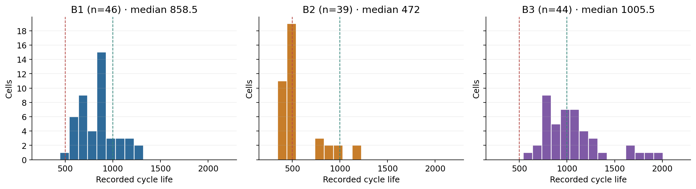
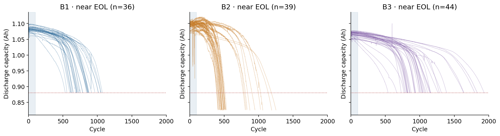
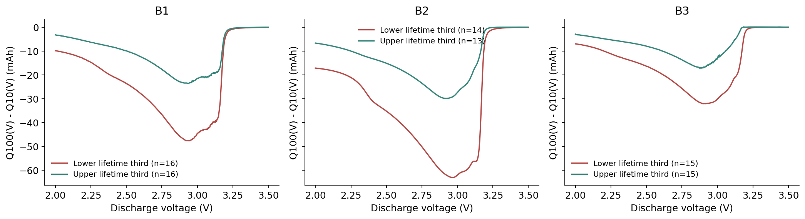
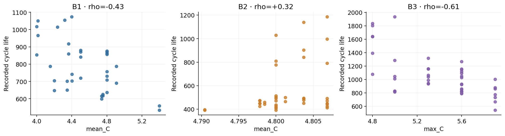
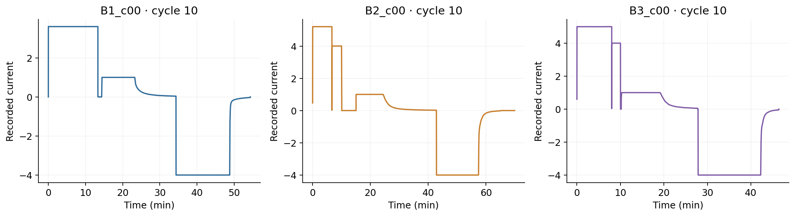
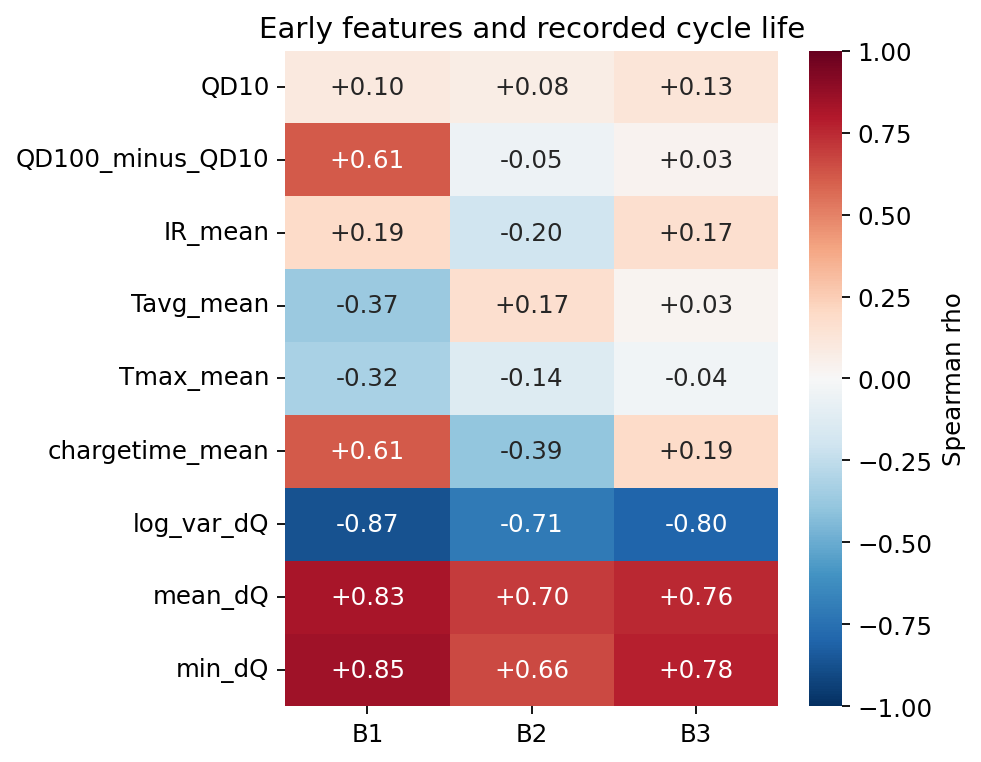

# EDA: 그림에서 모델 전략까지

[프로젝트 개요](../README.md) · [모델·논문 비교](analysis.md) · [실행 검증](validation.md) · [Day 1 계획서](day1-plan.pdf)

Day 1의 다섯 질문에서 무엇을 확인했고, 어떤 판단을 모델에 반영했는지 정리했다.

[수명 분포](#q1-수명-분포와-짧은-수명-셀) · [열화 곡선](#q2-열화-속도와-knee) · [초기 방전 곡선](#q3-δqv와-피처-요약) · [충전 조건](#q4-충전-조건과-실제-전류-패턴) · [상관·중복](#q5-중복과-정책-내부-관계)

수명 분포·ΔQ·상관 그림은 **레이블 보유 셀 전체**를, 열화 궤적·충전 정책 그림은 **종료 근접 셀**을 사용한다. B1의 모델 학습 대상은 종료 근접 36셀 중 28셀이다. [레이블·제외 기준](analysis.md#데이터와-레이블)

## Q1. 수명 분포와 짧은 수명 셀



점선은 500·1,000사이클 기준이다. 분포에는 B1에서 중도 종료 가능성이 있는 셀도 포함돼 있어, 저장 수명을 모두 실제 종료 수명으로 취급하지 않는다.

| 배치 | 레이블 보유 셀 | 중앙값 | 500 미만 | 1,000 초과 |
|---|---:|---:|---:|---:|
| B1 | 46 | 858.5 | 0.0% | 21.7% |
| B2 | 39 | 472.0 | 71.8% | 7.7% |
| B3 | 44 | 1,005.5 | 0.0% | 52.3% |

B1에는 B2에 많이 나타나는 짧은 수명 구간이 없었다. 학습 데이터 안에서 잘 맞는다는 것만으로 이런 셀의 수명까지 잘 맞힐 것이라고 기대하기 어려웠다. 그래서 B2 전체 오차와 함께 단수명·실험집단별 오류를 따로 확인했다.

배치별 가장 짧은 셀은 같은 정책의 동료 셀과 비교했으며, 수명이 짧다는 이유로 테스트 셀을 삭제하지 않았다. B1에서 550사이클 미만은 1셀뿐이라 장·단수명 분류 경계를 배우기도 어려웠다. 점검 우선순위를 비교할 수 있도록 연속 수명을 예측하는 **회귀**를 선택했다.

## Q2. 열화 속도와 knee



음영은 예측에 사용하는 초기 100사이클이고, 점선은 0.88 Ah다. B1 36셀·B2 39셀·B3 44셀의 궤적을 그렸다. 0.8–1.2 Ah 밖의 측정값은 그림에서 제외했다.

초기에는 용량이 비슷하게 유지되다가 뒤늦게 감소 속도가 커지는 모습을 볼 수 있었다. 현재 용량만 보고 앞으로의 수명을 판단하기 어려운 이유다. 종료 근접 셀의 수명 하위·상위 1/3을 비교하면, 초기 10→100사이클 변화의 중앙값은 절댓값 약 0.02 mAh/사이클 이하로 작았다. 통계적으로 차이가 없음을 입증한 결과는 아니다.

마지막 20% 구간의 감소 속도는 하위 1/3이 상위 1/3보다 B1 1.47배·B2 1.80배·B3 1.60배 빨랐다. 이 후반 정보는 이미 미래를 본 결과이므로 모델 입력에 쓰지 않았다.

<details>
<summary>knee 탐색 기준과 초기 기록 공백</summary>

탐색 knee 중앙값은 B1 579·B2 361·B3 827사이클이었다. 100사이클 이후 경로를 7점 중앙값으로 평활한 뒤 두 직선을 적합하고, SSE 20% 이상 감소·후반 기울기 1.5배 이상 증가 조건으로 탐색했다. 물리적 knee의 정답은 아니다.

B2 39셀 모두 초기 구간 내부에 약 65.35시간의 측정 간격이 있었다. `t`의 인접 기록 차이로 확인했으며, 휴지·측정 누락·실험 조치 중 무엇인지는 확정하지 않았다. 공백이 예측 오류의 원인이라는 주장도 하지 않는다.

</details>

[셀별 열화 속도](../results/fade_rates.csv) · [knee 탐색값](../results/knee_estimates.csv)

## Q3. ΔQ(V)와 피처 요약



각 배치 안에서 수명 하위·상위 1/3의 평균 곡선을 비교했다. 여기서 하위·상위는 절대적인 500·1,000사이클 구분이 아니다.

`ΔQ(V) = Q100(V) − Q10(V)`를 1,000개 전압점에서 계산한다. 실제 `summary.cycle`과 배열 인덱스 9·99를 대조했고, 원본 전압축 `Vdlin`은 3.5→2.0V다.

용량 곡선에서 잘 드러나지 않았던 차이가 전압별 방전 곡선의 변화에서는 보였다. 수명 하위 1/3에서 변화가 더 컸고, `log10 var(ΔQ)`와 총 수명의 Spearman 상관은 B1 −0.871·B2 −0.709·B3 −0.797이었다. 이 방향이 배치마다 같다는 점을 근거로 ΔQ 분산을 핵심 후보로 삼았다. 같은 방향의 상관이 모든 배치에서 같은 예측식을 보장하지는 않는다.

## Q4. 충전 조건과 실제 전류 패턴



종료 근접 셀 기준이다. 가로축은 B1·B2에서 명목 평균 C-rate(`mean_C`), B3에서 최대 C-rate(`max_C`)로 서로 다르다. B2의 평균 C-rate는 약 4.79–4.81 C로 거의 일정해, 이 그림의 상관만으로 충전 속도의 영향을 판단하지 않았다.

B1 종료 근접 36셀의 평균 C-rate와 수명은 ρ=−0.435였다. 그러나 같은 4.8C(80%)-4.8C 정책에서도 배치·실험집단에 따라 평균 수명이 약 484–1,564사이클로 달랐다. 충전 속도만으로 배터리 수명을 설명하기는 어려웠다. 그래서 정책 단독·ΔQ 단독·결합 입력을 비교했다.



각 배치에서 대표 셀 하나의 cycle 10을 보여주는 진단 그림이다. 전체 셀의 관계는 별도로 집계했다.

cycle 10의 첫 방전 전까지 양의 전류가 흐르는 시간 중 **저장 전류 > 4.2**인 비율을 확인했다. 1분 이상의 기록 간격은 제외했다. 이 비율과 수명의 상관은 B1 −0.29·B2 +0.05·B3 +0.40, 후반 용량 감소 속도와의 상관은 −0.07·−0.21·−0.24였다. 관계가 배치에 따라 달라 현재 모델의 입력으로 채택하지 않았다.

<details>
<summary>충전 정책 피처 정의</summary>

원정책은 `C1`, `C2`, `SOC1`을, 파생정책은 명목 평균 `mean_C`와 최대 `max_C`를 사용한다. `s = min(SOC1/100, 0.8)`일 때 `mean_C = 0.8 / [s/C1 + (0.8−s)/C2]`다. 이 값은 저장된 실제 전류 자체와 구분한다.

</details>

## Q5. 중복과 정책 내부 관계



레이블 보유 셀 전체 기준의 Spearman 상관이다. IR의 0값은 결측으로 취급했다. `QD10`은 초기 용량, `QD100_minus_QD10`은 초기 용량 변화이며, `IR_mean`·`Tavg_mean`·`Tmax_mean`은 초기 저항·온도 요약이다.

ΔQ 통계는 수명과 연결돼 있었지만 서로 비슷한 정보를 담고 있었다. B1 종료 근접 셀에서 분산·평균·최솟값 간 |ρ|는 약 0.966–0.988이었다. 작은 데이터에 비슷한 변수를 계속 더하기보다 분산 하나로 시작했다. 분산 입력의 왜도는 +1.11에서 로그 변환 후 +0.22로 줄었고, 수명 자체의 왜도는 +0.30이었다. 그래서 입력 변환과 타깃 변환을 따로 비교했다.

정책 변수도 독립적이지 않았다. `C1`과 `SOC1`은 ρ=−0.878이고, 정책 평균을 제거하면 ΔQ–수명 상관은 약 −0.83에서 −0.12로 약해졌다. 강한 전체 상관만 보고 새 정보를 얻었다고 판단하기 어려웠다. 정책 단독·ΔQ 단독·결합 입력의 실제 CV를 비교해 추가 이득을 확인했다. 정책 안의 표본도 작아 이 값만으로 ΔQ가 무용하다고 결론 내리지는 않았다.

[피처별 상관계수](../results/feature_correlations.csv) · [정책별 표본·수명](../results/policy_summary.csv) · [EDA 통계](../results/eda_metrics.json)

## 그림과 수치 재현

모든 그림은 이 저장소의 현재 캐시에서 다시 생성했다. 재실행은 [데이터 준비](../data/README.md)와 전처리 후 프로젝트 루트에서 진행한다.

```bash
python -m src.preprocess
python -m src.eda
python scripts/export_eda_figures.py
```

[그림 생성 코드](../scripts/export_eda_figures.py) · [전체 EDA 노트북](../notebooks/01_EDA.ipynb) · [모델 선택으로 이어 보기](analysis.md#전략의-구현과-모델-선택)
